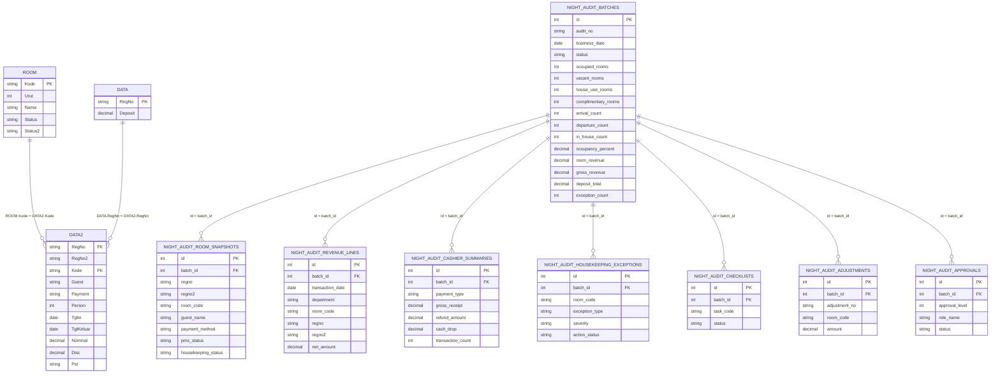
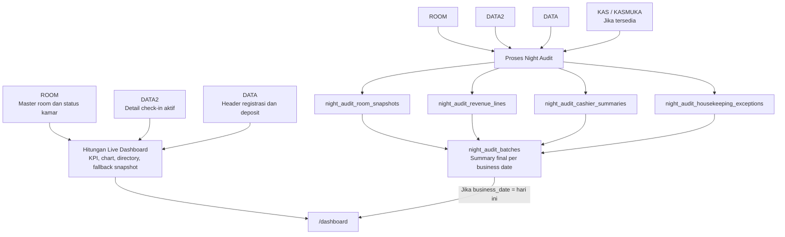

# Dokumentasi Dashboard

Dashboard utama ada di route `/dashboard`, dikendalikan oleh `app/Http/Controllers/DashboardController.php`, dan ditampilkan lewat `resources/views/dashboard.blade.php`.

## Alur Pengambilan Data

Dashboard memakai dua jenis sumber data:

1. Data live dari tabel operasional PMS.
2. Data summary hasil Night Audit, bila batch audit untuk business date hari ini sudah ada.

Data room status, KPI utama, chart status, dan daftar room per status selalu dihitung live dari `ROOM` dan `DATA2`. Panel `Today Snapshot` memakai data `night_audit_batches` jika tersedia untuk tanggal hari ini. Jika belum ada batch Night Audit hari ini, panel itu memakai data live dari `DATA2`, `DATA`, dan hasil hitungan room status.

## Tabel Yang Dipakai

| Tabel | Fungsi di Dashboard | Kolom Penting |
| --- | --- | --- |
| `ROOM` | Master room dan status fisik/front office room. Menjadi basis total kamar dan daftar room per status. | `Kode`, `Urut`, `Nama`, `Status`, `Status2` |
| `DATA2` | Detail registrasi/check-in aktif. Menentukan kamar yang sedang occupied dan informasi tamu aktif. | `Kode`, `RegNo`, `Payment`, `Person`, `Package`, `TglIn`, `TglKeluar`, `Nominal`, `Disc`, `Pst` |
| `DATA` | Header registrasi. Dipakai untuk membaca deposit aktif melalui relasi `DATA2.RegNo = DATA.RegNo`. | `RegNo`, `Deposit` |
| `night_audit_batches` | Summary hasil Night Audit. Jika ada batch untuk business date hari ini, beberapa angka `Today Snapshot` memakai tabel ini. | `business_date`, `status`, `occupied_rooms`, `vacant_rooms`, `house_use_rooms`, `complimentary_rooms`, `arrival_count`, `departure_count`, `in_house_count`, `occupancy_percent`, `room_revenue`, `gross_revenue`, `deposit_total`, `exception_count` |
| `night_audit_room_snapshots` | Detail snapshot room saat Night Audit. Tidak dibaca langsung oleh dashboard saat ini, tetapi menjadi salah satu sumber pembentuk `night_audit_batches`. | `batch_id`, `room_code`, `guest_name`, `payment_method`, `pms_status`, `housekeeping_status`, `net_room_rate` |
| `night_audit_revenue_lines` | Detail revenue hasil Night Audit. Tidak dibaca langsung oleh dashboard saat ini, tetapi diringkas ke `night_audit_batches`. | `batch_id`, `department`, `debit`, `credit`, `net_amount` |
| `night_audit_cashier_summaries` | Summary cashier/payment hasil Night Audit. Tidak dibaca langsung oleh dashboard saat ini, tetapi diringkas ke `night_audit_batches`. | `batch_id`, `payment_type`, `gross_receipt`, `refund_amount`, `cash_drop`, `variance_amount` |
| `night_audit_housekeeping_exceptions` | Exception housekeeping hasil Night Audit. Tidak dibaca langsung oleh dashboard saat ini, tetapi jumlah exception diringkas ke `night_audit_batches`. | `batch_id`, `room_code`, `exception_type`, `severity`, `action_status` |

## Kebutuhan Tabel

Tabel yang wajib untuk dashboard live:

| Tabel | Wajib | Keterangan |
| --- | --- | --- |
| `ROOM` | Ya | Sumber master room, status room, housekeeping status, dan daftar room. |
| `DATA2` | Ya | Sumber check-in aktif, occupancy, pax, arrival, departure, payment, dan rate live. |
| `DATA` | Ya untuk deposit | Dipakai untuk `Deposit Total`. Jika deposit tidak ingin ditampilkan, dashboard masih bisa berjalan tanpa angka deposit yang lengkap. |

Tabel yang wajib untuk membaca hasil Night Audit:

| Tabel | Wajib | Keterangan |
| --- | --- | --- |
| `night_audit_batches` | Ya | Summary utama yang dibaca dashboard untuk panel `Today Snapshot` saat batch tanggal hari ini ada. |
| `night_audit_room_snapshots` | Ya untuk modul Night Audit | Detail room in-house hasil snapshot audit. |
| `night_audit_revenue_lines` | Ya untuk modul Night Audit | Detail revenue yang diringkas menjadi revenue di batch. |
| `night_audit_cashier_summaries` | Ya untuk modul Night Audit | Detail cashier/payment yang diringkas menjadi deposit/cashier summary. |
| `night_audit_housekeeping_exceptions` | Ya untuk modul Night Audit | Detail exception housekeeping yang diringkas menjadi `exception_count`. |
| `night_audit_checklists` | Ya untuk modul Night Audit | Checklist kontrol audit. Tidak dibaca dashboard utama saat ini. |
| `night_audit_adjustments` | Ya untuk modul Night Audit | Adjustment audit. Tidak dibaca dashboard utama saat ini. |
| `night_audit_approvals` | Ya untuk modul Night Audit | Approval audit. Tidak dibaca dashboard utama saat ini. |

Tabel sumber tambahan yang dipakai proses Night Audit jika tersedia:

| Tabel | Keterangan |
| --- | --- |
| `KAS` | Sumber transaksi cashier pada `Tgl`, dipakai untuk membentuk `night_audit_cashier_summaries`. |
| `KASMUKA` | Sumber transaksi deposit/uang muka pada `TglC`, dipakai untuk membentuk `night_audit_cashier_summaries`. |

## Diagram Relasi Tabel

Relasi di bawah adalah relasi logis yang dipakai aplikasi. Pada database legacy, tidak semua relasi ini harus berupa foreign key fisik.



## Diagram Alur Data



## Filter Dasar

Data room:

```text
ROOM.Kode <> '999'
```

Data check-in aktif:

```text
DATA2.Pst = ' '
DATA2.Kode <> '999'
```

Artinya, room `999` dikecualikan dari dashboard dan hanya detail `DATA2` yang masih aktif/in-house yang dihitung sebagai occupancy live.

## Logika Status Room

Dashboard membangun status room dengan join:

```text
ROOM.Kode = DATA2.Kode
```

Urutan logika status:

| Kondisi | Status Dashboard |
| --- | --- |
| Ada baris aktif di `DATA2` untuk `ROOM.Kode` yang sama | `Occupied` |
| `ROOM.Status = 'Check Out'` | `Vacant Dirty` |
| `ROOM.Status = 'Out Of Order'` | `Out Of Order` |
| `ROOM.Status = 'Vacant Dirty'` | `Vacant Dirty` |
| `ROOM.Status = 'Renovated'` | `Renovated` |
| `ROOM.Status = 'Vacant Ready'` | `Vacant Ready` |
| `ROOM.Status = 'Vacant Clean'` | `Vacant Clean` |
| `ROOM.Status = 'Owner Unit'` | `Owner Unit` |
| `ROOM.Status = 'Complimentary'` | `Complimentary` |
| Selain kondisi di atas | Nilai asli `ROOM.Status` atau `Unknown` |

Catatan khusus:

- Jika room occupied tetapi `DATA2.Payment = 'COMPLIMENT'`, room masuk ke `Complimentary`, bukan `Occupied` reguler.
- `Owner Unit` dihitung sebagai owner unit dan juga masuk perhitungan complimentary internal. Untuk tampilan `Complimentary Rooms`, dashboard memakai `complimentary - owner_unit` agar owner unit tidak dobel tampil sebagai complimentary biasa.
- `ROOM.Status2 = 'Occupied Clean'` dipakai untuk breakdown `Occupied Clean`. Selain itu dianggap `Occupied Dirty`.

## Rumus Utama

| Nama | Rumus |
| --- | --- |
| `Total Rooms` | Jumlah row `ROOM` dengan `Kode <> '999'` |
| `Operational Base` / `Sellable Rooms` | `Total Rooms - Check Out - Renovated - Out Of Order - Complimentary` |
| `In House` | `Occupied + Complimentary Rooms + Owner Unit` |
| `Available` | `Vacant Ready + Vacant Clean` |
| `Restricted` | `Renovated + Out Of Order` |
| `% Occupancy` live | `In House / Operational Base * 100` |
| `Room Revenue` live | Sum `DATA2.Nominal - discount`, hanya untuk `DATA2` aktif dan bukan payment complimentary/house use |
| `Deposit Total` live | Sum `DATA.Deposit` untuk `DATA2` aktif melalui `RegNo` |

Jika `Operational Base` bernilai 0 atau kurang, controller memakai nilai minimal 1 untuk menghindari pembagian nol.

## Rumus Detail Per Header

Bagian ini menjelaskan cara menghitung angka yang tampil di setiap header dashboard.

### Variabel Dasar

| Variabel | Rumus / Cara Ambil |
| --- | --- |
| `total_rooms` | `COUNT(ROOM)` dengan `ROOM.Kode <> '999'` |
| `active_data2` | Row `DATA2` dengan `DATA2.Pst = ' '` dan `DATA2.Kode <> '999'` |
| `occupied` | Room di `ROOM` yang punya pasangan `active_data2` berdasarkan `ROOM.Kode = DATA2.Kode`, kecuali payment `COMPLIMENT` |
| `complimentary_total` | Room active dengan `DATA2.Payment = 'COMPLIMENT'`, ditambah room status `Owner Unit` karena owner unit juga masuk hitungan complimentary internal |
| `owner_unit` | Room dengan status `Owner Unit` |
| `complimentary_rooms` | `max(complimentary_total - owner_unit, 0)` |
| `check_out` | Room dengan `ROOM.Status = 'Check Out'` |
| `vacant_ready` | Room dengan `ROOM.Status = 'Vacant Ready'` |
| `vacant_clean` | Room dengan `ROOM.Status = 'Vacant Clean'` |
| `vacant_dirty` | Room dengan `ROOM.Status = 'Vacant Dirty'` atau `ROOM.Status = 'Check Out'` |
| `renovated` | Room dengan `ROOM.Status = 'Renovated'` |
| `out_of_order` | Room dengan `ROOM.Status = 'Out Of Order'` |
| `restricted` | `renovated + out_of_order` |
| `operational_base` | `total_rooms - check_out - renovated - out_of_order - complimentary_total` |
| `operational_base_safe` | Jika `operational_base > 0`, pakai `operational_base`; jika tidak, pakai `1` |
| `total_base_safe` | Jika `total_rooms > 0`, pakai `total_rooms`; jika tidak, pakai `1` |
| `in_house` | `occupied + complimentary_rooms + owner_unit` |
| `available` | `vacant_ready + vacant_clean` |

### Top KPI Cards

| Header | Rumus |
| --- | --- |
| `Total Rooms` | `total_rooms` |
| `Sellable Rooms` | `operational_base_safe` |
| `In House` | `in_house` |
| Note pada `In House` | `(in_house / total_base_safe) * 100` |
| `Available` | `available` |
| Note pada `Available` | `(available / total_base_safe) * 100` |
| `Vacant Dirty` | `vacant_dirty` |
| `Restricted` | `renovated + out_of_order` |

### Clean / Dirty Status Chart

| Segmen | Rumus |
| --- | --- |
| `Ready` | `vacant_ready` |
| `Clean` | `vacant_clean` |
| `Dirty` | `vacant_dirty` |
| `Occupied` | `occupied` |
| `Comp` | `complimentary_rooms + owner_unit` |
| `Restricted` | `renovated + out_of_order` |
| Total chart | `vacant_ready + vacant_clean + vacant_dirty + occupied + complimentary_rooms + owner_unit + restricted` |
| Lebar segmen | `(nilai_segmen / total_chart) * 100` |

Jika total chart bernilai 0, dashboard memakai total minimal `1` supaya pembagian tidak error.

### Breakdown Cards

| Header | Rumus |
| --- | --- |
| `Occupied Clean` | Count occupied dengan `ROOM.Status2 = 'Occupied Clean'` |
| `Occupied Dirty` | Count occupied dengan `ROOM.Status2` selain `Occupied Clean` |
| `Ready + Clean` | `vacant_ready + vacant_clean` |

Dashboard juga menghitung breakdown umur stay:

| Nama Internal | Rumus |
| --- | --- |
| `Occ Clean <= 2` | Occupied clean dengan selisih hari dari `DATA2.TglIn` sampai hari ini `<= 2` |
| `Occ Clean > 2` | Occupied clean dengan selisih hari dari `DATA2.TglIn` sampai hari ini `> 2` |
| `Occ Dirty <= 2` | Occupied dirty dengan selisih hari dari `DATA2.TglIn` sampai hari ini `<= 2` |
| `Occ Dirty > 2` | Occupied dirty dengan selisih hari dari `DATA2.TglIn` sampai hari ini `> 2` |

### Today Snapshot - Mode Live DATA2

Rumus ini dipakai jika belum ada row `night_audit_batches` untuk business date hari ini.

| Header | Rumus Live |
| --- | --- |
| `Rooms Available` | `vacant_ready + vacant_clean` |
| `Estimated Occupied` | `occupied + complimentary_rooms + owner_unit` |
| `Guests In House` | `SUM(DATA2.Person)` dari `active_data2` |
| `Arrival Today` | `COUNT(DATA2)` dengan `DATE(DATA2.TglIn) = today`, `DATA2.Kode <> '999'` |
| `Departure Today` | `COUNT(DATA2)` dengan `DATE(DATA2.TglKeluar) = today`, `DATA2.Kode <> '999'` |
| `Complimentary Rooms` | `complimentary_rooms` |
| `Owner Unit` | `owner_unit` |
| `Vacant Ready` | `vacant_ready` |
| `Vacant Clean` | `vacant_clean` |
| `Vacant Dirty` | `vacant_dirty` |
| `Renovated` | `renovated` |
| `Out Of Order` | `out_of_order` |
| `% Occupancy` | `(in_house / operational_base_safe) * 100` |
| `Room Revenue` | `SUM(DATA2.Nominal - (DATA2.Nominal * DATA2.Disc / 100))` dari `active_data2`, kecuali payment mengandung `COMPLIMENT` atau `HOUSE` |
| `Total Revenue` | Sama dengan `Room Revenue` pada mode live karena belum ada summary Night Audit lengkap |
| `Deposit Total` | `SUM(DATA.Deposit)` dengan join `DATA2.RegNo = DATA.RegNo` untuk `active_data2` |
| `Night Audit Exceptions` | `0` |

### Today Snapshot - Mode Night Audit

Rumus ini dipakai jika ada row `night_audit_batches` untuk business date hari ini. Dashboard mengambil batch terbaru berdasarkan `id desc`.

| Header | Rumus / Kolom Night Audit |
| --- | --- |
| `Rooms Available` | `night_audit_batches.vacant_rooms` |
| `Estimated Occupied` | `night_audit_batches.occupied_rooms` |
| `Guests In House` | `night_audit_batches.in_house_count` |
| `Arrival Today` | `night_audit_batches.arrival_count` |
| `Departure Today` | `night_audit_batches.departure_count` |
| `Complimentary Rooms` | `night_audit_batches.complimentary_rooms` |
| `Owner Unit` | `night_audit_batches.house_use_rooms` |
| `Vacant Ready` | Tetap memakai hitungan live `ROOM.Status = 'Vacant Ready'` |
| `Vacant Clean` | Tetap memakai hitungan live `ROOM.Status = 'Vacant Clean'` |
| `Vacant Dirty` | Tetap memakai hitungan live `ROOM.Status = 'Vacant Dirty'` atau `Check Out` |
| `Renovated` | Tetap memakai hitungan live `ROOM.Status = 'Renovated'` |
| `Out Of Order` | Tetap memakai hitungan live `ROOM.Status = 'Out Of Order'` |
| `% Occupancy` | `night_audit_batches.occupancy_percent` |
| `Room Revenue` | `night_audit_batches.room_revenue` |
| `Total Revenue` | `night_audit_batches.gross_revenue` |
| `Deposit Total` | `night_audit_batches.deposit_total` |
| `Night Audit Exceptions` | `night_audit_batches.exception_count` |

### Room Status Directory

| Header | Rumus Daftar Room |
| --- | --- |
| `Occupied` | Semua `ROOM.Kode` yang punya active `DATA2`, payment bukan `COMPLIMENT` |
| `Vacant Ready` | Semua `ROOM.Kode` dengan `ROOM.Status = 'Vacant Ready'` |
| `Vacant Clean` | Semua `ROOM.Kode` dengan `ROOM.Status = 'Vacant Clean'` |
| `Vacant Dirty` | Semua `ROOM.Kode` dengan `ROOM.Status = 'Vacant Dirty'` atau `Check Out` |
| `Complimentary` | Semua `ROOM.Kode` dari active `DATA2` dengan `DATA2.Payment = 'COMPLIMENT'` |
| `Owner Unit` | Semua `ROOM.Kode` dengan `ROOM.Status = 'Owner Unit'` |
| `Renovated` | Semua `ROOM.Kode` dengan `ROOM.Status = 'Renovated'` |
| `Out Of Order` | Semua `ROOM.Kode` dengan `ROOM.Status = 'Out Of Order'` |

## Arti Header / Panel Dashboard

### Top KPI Cards

| Header | Arti | Sumber |
| --- | --- | --- |
| `Total Rooms` | Total seluruh room aktif di master room. | `ROOM` |
| `Sellable Rooms` | Room yang dianggap bisa menjadi basis jual/occupancy setelah dikurangi room non-operasional dan complimentary. | Hitungan dari `ROOM` + `DATA2` |
| `In House` | Estimasi room yang sedang dihuni, termasuk complimentary dan owner unit. | `DATA2` aktif + status room |
| `Available` | Room kosong yang bisa disiapkan/dijual, yaitu `Vacant Ready + Vacant Clean`. | `ROOM.Status` |
| `Vacant Dirty` | Room kosong atau check-out yang masih perlu housekeeping. | `ROOM.Status` dan status `Check Out` |
| `Restricted` | Room yang tidak tersedia karena `Renovated` atau `Out Of Order`. | `ROOM.Status` |

### Clean / Dirty Status

| Header | Arti | Sumber |
| --- | --- | --- |
| `Ready` | Jumlah room `Vacant Ready`. | `ROOM.Status` |
| `Clean` | Jumlah room `Vacant Clean`. | `ROOM.Status` |
| `Dirty` | Jumlah room `Vacant Dirty`, termasuk room `Check Out`. | `ROOM.Status` |
| `Occupied` | Room occupied reguler, tidak termasuk complimentary. | `DATA2` aktif |
| `Comp` | Total complimentary dan owner unit. | `DATA2.Payment`, `ROOM.Status` |
| `Restricted` | Total room renovated dan out of order. | `ROOM.Status` |

### Breakdown Cards

| Header | Arti | Sumber |
| --- | --- | --- |
| `Occupied Clean` | Room occupied dengan housekeeping status `Occupied Clean`. | `DATA2` aktif + `ROOM.Status2` |
| `Occupied Dirty` | Room occupied yang bukan `Occupied Clean`. | `DATA2` aktif + `ROOM.Status2` |
| `Ready + Clean` | Room available yang siap/bersih, yaitu `Vacant Ready + Vacant Clean`. | `ROOM.Status` |

### Today Snapshot

Panel ini menampilkan label sumber data di kanan atas:

- `Live DATA2`: belum ada batch Night Audit hari ini, data diambil dari live PMS.
- `Night Audit Draft/Closed/Approved`: batch Night Audit hari ini ada, data summary diambil dari `night_audit_batches`.

| Header | Arti | Sumber Live | Sumber Night Audit Jika Ada |
| --- | --- | --- | --- |
| `Rooms Available` | Jumlah room available. | `Vacant Ready + Vacant Clean` | `night_audit_batches.vacant_rooms` |
| `Estimated Occupied` | Jumlah room occupied estimasi. | `Occupied + Complimentary + Owner Unit` | `night_audit_batches.occupied_rooms` |
| `Guests In House` | Jumlah pax/tamu aktif. | Sum `DATA2.Person` untuk `DATA2.Pst = ' '` | `night_audit_batches.in_house_count` |
| `Arrival Today` | Check-in yang tanggal masuknya hari ini. | Count `DATA2.TglIn = today` | `night_audit_batches.arrival_count` |
| `Departure Today` | Expected departure hari ini. | Count `DATA2.TglKeluar = today` | `night_audit_batches.departure_count` |
| `Complimentary Rooms` | Room complimentary biasa, tidak termasuk owner unit. | `DATA2.Payment = 'COMPLIMENT'`, dikurangi owner unit | `night_audit_batches.complimentary_rooms` |
| `Owner Unit` | Room owner unit/house use. | `ROOM.Status = 'Owner Unit'` | `night_audit_batches.house_use_rooms` |
| `Vacant Ready` | Room vacant ready. | `ROOM.Status = 'Vacant Ready'` | Tetap live dari `ROOM` |
| `Vacant Clean` | Room vacant clean. | `ROOM.Status = 'Vacant Clean'` | Tetap live dari `ROOM` |
| `Vacant Dirty` | Room vacant dirty/check-out dirty. | `ROOM.Status = 'Vacant Dirty'` atau `Check Out` | Tetap live dari `ROOM` |
| `Renovated` | Room renovated. | `ROOM.Status = 'Renovated'` | Tetap live dari `ROOM` |
| `Out Of Order` | Room out of order. | `ROOM.Status = 'Out Of Order'` | Tetap live dari `ROOM` |
| `% Occupancy` | Persentase occupancy. | `In House / Operational Base * 100` | `night_audit_batches.occupancy_percent` |
| `Room Revenue` | Estimasi room revenue aktif. | Sum `DATA2.Nominal - Disc`, exclude complimentary/house use | `night_audit_batches.room_revenue` |
| `Total Revenue` | Total revenue yang tersedia di snapshot. | Sama dengan room revenue live saat belum ada Night Audit | `night_audit_batches.gross_revenue` |
| `Deposit Total` | Total deposit aktif. | Sum `DATA.Deposit` via `DATA2.RegNo = DATA.RegNo` | `night_audit_batches.deposit_total` |
| `Night Audit Exceptions` | Jumlah exception audit. | `0` jika belum ada Night Audit | `night_audit_batches.exception_count` |

### Room Status Directory

Panel directory menampilkan daftar nomor room per status. Headernya:

| Header | Arti |
| --- | --- |
| `Occupied` | Daftar room yang sedang dihuni reguler. |
| `Vacant Ready` | Daftar room ready untuk dijual/dipakai. |
| `Vacant Clean` | Daftar room kosong dan bersih, tetapi belum masuk ready. |
| `Vacant Dirty` | Daftar room kosong yang perlu dibersihkan, termasuk check-out dirty. |
| `Complimentary` | Daftar room complimentary. |
| `Owner Unit` | Daftar room owner unit/house use. |
| `Renovated` | Daftar room dalam renovasi. |
| `Out Of Order` | Daftar room tidak bisa dipakai karena rusak/tidak operasional. |

Jika daftar room panjang, dashboard menampilkan sebagian dulu dan menyediakan tombol `more +` / `less -`.

## Catatan Night Audit

Tabel `night_audit_batches` adalah summary final yang dibaca dashboard untuk panel `Today Snapshot`. Isi tabel ini dibuat oleh proses Night Audit dari beberapa tabel detail:

- `night_audit_room_snapshots`
- `night_audit_revenue_lines`
- `night_audit_cashier_summaries`
- `night_audit_housekeeping_exceptions`
- `night_audit_checklists`
- `night_audit_adjustments`
- `night_audit_approvals`

Saat dashboard dibuka, controller mencari batch dengan:

```text
night_audit_batches.business_date = today
order by id desc
```

Jika tidak ditemukan, dashboard tetap berjalan dengan fallback live dari `ROOM`, `DATA2`, dan `DATA`.
