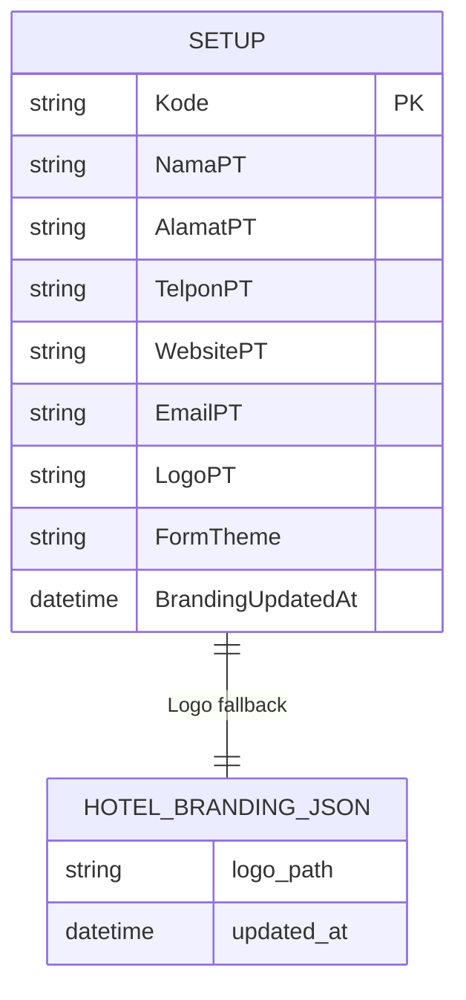
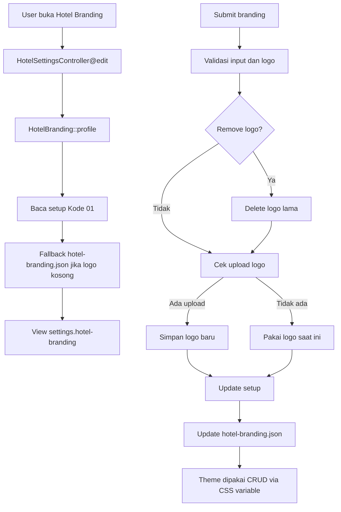

# Hotel Branding CRUD

Dokumen ini menjelaskan pengaturan Hotel Branding pada route `/settings/hotel-branding`.

## File Terkait

| Bagian | File |
| --- | --- |
| Controller | `app/Http/Controllers/HotelSettingsController.php` |
| Helper | `app/Support/HotelBranding.php` |
| View | `resources/views/settings/hotel-branding.blade.php` |
| Route web | `routes/web.php` |
| Theme partial | `resources/views/partials/crud-package-theme.blade.php` |

## Fungsi

Hotel Branding menyimpan profil hotel, logo, dan pilihan tema warna form. Tema ini dipakai oleh layout dan CRUD yang include `partials.crud-package-theme`.

## Tabel Dan File Yang Dipakai

| Sumber | Fungsi | Field Utama |
| --- | --- | --- |
| `setup` | Profil hotel utama. | `Kode`, `NamaPT`, `UsahaPT`, `FaxPT`, `AlamatPT`, `AlamatPT2`, `TelponPT`, `WebsitePT`, `EmailPT`, `LogoPT`, `FormTheme`, `BrandingUpdatedAt` |
| `storage/app/public/hotel-branding/*` | Lokasi file logo upload. | File image |
| `storage/app/hotel-branding.json` | Legacy fallback path logo. | `logo_path`, `updated_at` |

## Relasi Data



## Endpoint

| Method | Route | Fungsi |
| --- | --- | --- |
| GET | `/settings/hotel-branding` | Tampilkan form profil hotel, logo, dan pilihan theme. |
| POST | `/settings/hotel-branding` | Simpan profil, theme, upload logo, atau hapus logo. |
| GET | `/settings/hotel-branding/logo` | Menampilkan file logo aktif. |

## Cara Kerja

### Edit

1. `HotelBranding::profile()` membaca default profile.
2. Profile dari `setup` dengan `Kode = '01'` menimpa default.
3. Jika `LogoPT` kosong, helper mencoba fallback `storage/app/hotel-branding.json`.
4. View menampilkan theme options dan preview.

### Update

1. Validasi field profil hotel.
2. Validasi `logo` harus image dan maksimal 4096 KB.
3. Normalisasi `FormTheme` supaya hanya menerima theme yang tersedia.
4. Jika `remove_logo` aktif, file logo lama dihapus.
5. Jika upload logo baru, file lama dihapus dan file baru disimpan ke `storage/app/public/hotel-branding/`.
6. Update row `setup`:
   - field profil `NamaPT`, `AlamatPT`, dan lain-lain
   - field legacy `NAMAHOTEL`, `ALAMATHOTEL`, `TELPONHOTEL`
   - `LogoPT` jika kolom ada
   - `FormTheme` jika kolom ada
   - `BrandingUpdatedAt` jika kolom ada
7. Update fallback `storage/app/hotel-branding.json`.

## Theme Yang Tersedia

| Key | Label |
| --- | --- |
| `ocean-blue` | Ocean Blue |
| `soft-gold` | Soft Gold |
| `forest-sage` | Forest Sage |
| `rose-champagne` | Rose Champagne |
| `stone-navy` | Stone Navy |

## Dampak Ke CRUD

`HotelBranding::themeVariables()` menghasilkan CSS variable:

```text
--package-page-bg
--package-shell-bg
--package-shell-border
--package-header-bg
--package-heading-bg
--package-title
--package-text
--package-muted
--package-label
--package-input-bg
--package-input-border
--package-button-primary
--package-table-head-bg
```

CRUD yang include `partials.crud-package-theme` akan mengikuti warna Hotel Branding.

## Diagram Alur Kerja



