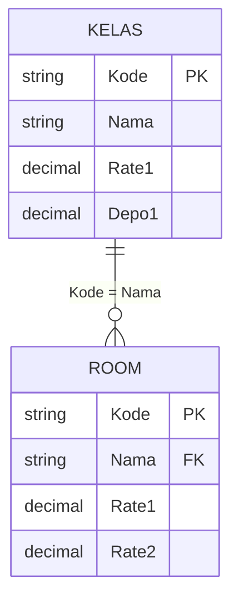
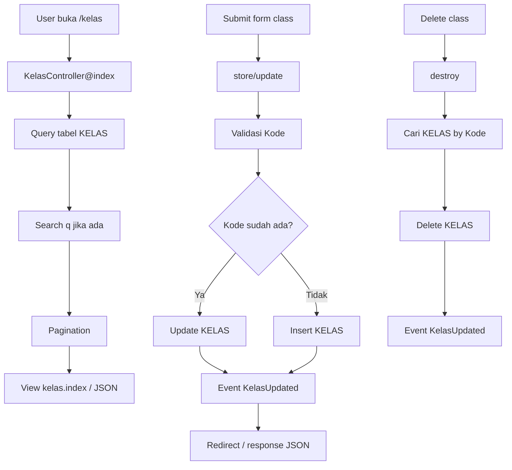

# Kelas CRUD

Dokumen ini menjelaskan CRUD Room Class pada route `/kelas` dan API `/api/v1/kelas`.

## File Terkait

| Bagian | File |
| --- | --- |
| Controller | `app/Http/Controllers/KelasController.php` |
| View | `resources/views/kelas/index.blade.php` |
| Route web | `routes/web.php` |
| Route API | `routes/api.php` |
| Event | `app/Events/KelasUpdated.php` |

## Fungsi

CRUD ini mengelola master class/tipe kamar. Data class dipakai oleh master room untuk menentukan jenis kamar dan rate default.

## Tabel Yang Dipakai

| Tabel | Fungsi | Kolom Utama |
| --- | --- | --- |
| `KELAS` | Master room class. | `Kode`, `Nama`, `Rate1`, `Depo1` |
| `ROOM` | Tabel terkait yang menyimpan room per class. Tidak diubah langsung oleh CRUD ini. | `Kode`, `Nama`, `Rate1`, `Rate2` |

## Relasi Tabel

Relasi logis:

```text
KELAS.Kode = ROOM.Nama
```

Pada implementasi room, field `ROOM.Nama` berisi kode class.



## Endpoint

| Method | Web | API | Fungsi |
| --- | --- | --- | --- |
| GET | `/kelas` | `/api/v1/kelas` | List room class, search, dan pagination. |
| POST | `/kelas` | `/api/v1/kelas` | Simpan class baru atau update jika `Kode` sudah ada. |
| POST | `/kelas/{kode}/update` | PUT/PATCH `/api/v1/kelas/{kode}` | Update class berdasarkan `Kode`. |
| GET | `/kelas/{kode}/delete` | DELETE `/api/v1/kelas/{kode}` | Hapus class berdasarkan `Kode`. |

## Cara Kerja

### List

1. Ambil data dari `KELAS`.
2. Trim field `Kode` dan `Nama`.
3. Jika query `q` diisi, cari pada `Kode` atau `Nama`.
4. Urutkan berdasarkan `Kode`.
5. Tampilkan dengan pagination 10 row.

### Create / Store

1. Ambil `Kode`, `Nama`, `Rate1`, dan `Depo1`.
2. Validasi `Kode` wajib diisi.
3. Cek apakah `KELAS.Kode` sudah ada.
4. Jika sudah ada, sistem melakukan update.
5. Jika belum ada, sistem insert row baru.
6. Trigger event `KelasUpdated`.

### Update

1. Cari row berdasarkan `KELAS.Kode`.
2. Jika tidak ditemukan, return error 404.
3. Update `Nama`, `Rate1`, dan `Depo1`.
4. Trigger event `KelasUpdated`.

### Delete

1. Cari row berdasarkan `KELAS.Kode`.
2. Jika tidak ditemukan, return error 404.
3. Delete row dari `KELAS`.
4. Trigger event `KelasUpdated`.

Catatan: controller saat ini tidak mengecek apakah class masih dipakai di `ROOM` sebelum delete.

## Diagram Alur Kerja



