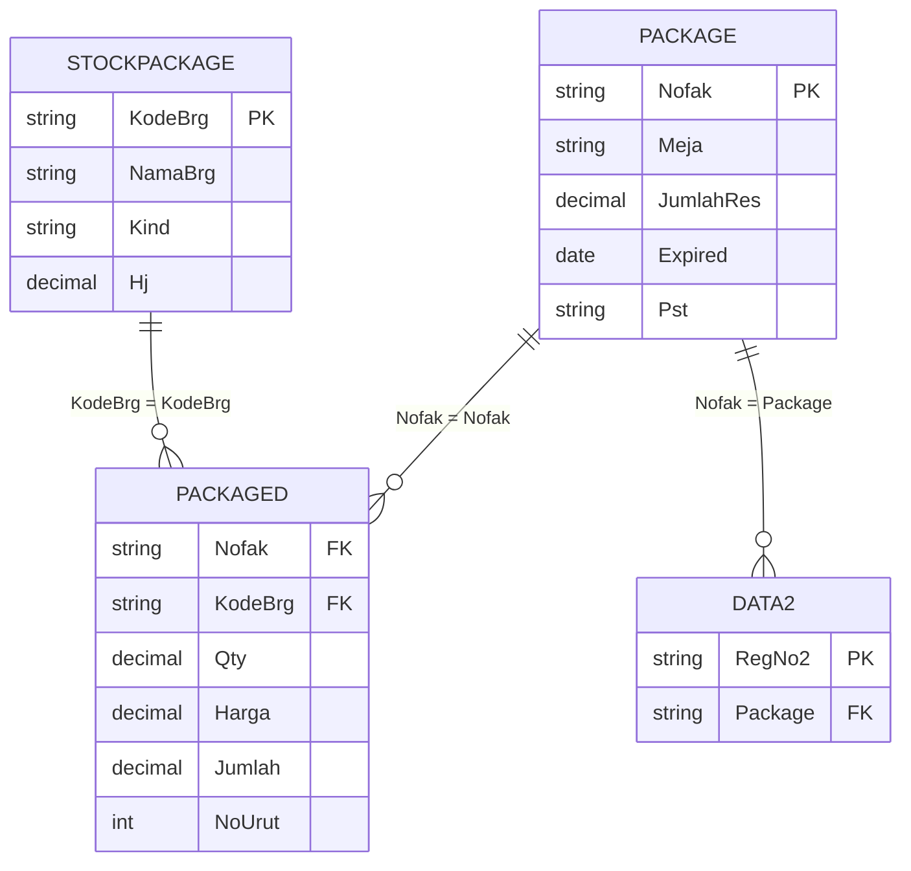
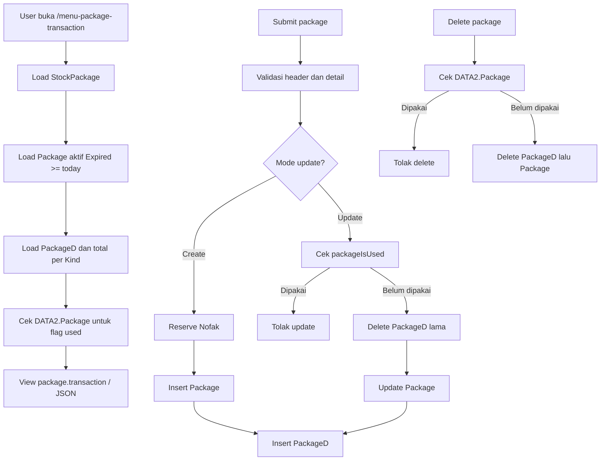

# Package Transaction CRUD

Dokumen ini menjelaskan CRUD transaksi package pada route `/menu-package-transaction` dan API `/api/v1/menu-package-transaction`.

## File Terkait

| Bagian | File |
| --- | --- |
| Controller | `app/Http/Controllers/PackageTransactionController.php` |
| View | `resources/views/package/transaction.blade.php` |
| Partial directory | `resources/views/package/partials/transaction-directory-section.blade.php` |
| Route web | `routes/web.php` |
| Route API | `routes/api.php` |

## Fungsi

CRUD ini membuat master package transaksi berisi header package dan detail item. Package ini kemudian dapat dipilih pada check-in melalui field package.

## Tabel Yang Dipakai

| Tabel | Fungsi | Kolom Utama |
| --- | --- | --- |
| `Package` | Header package. | `Nofak`, `Meja`, `JumlahRes`, `Expired`, `Tgl`, `Jam`, `Pst`, `UserName` |
| `PackageD` | Detail item package. | `Nofak`, `KodeBrg`, `Qty`, `Harga`, `Disc`, `Jumlah`, `NoUrut` |
| `StockPackage` | Master item yang dapat masuk package. | `KodeBrg`, `NamaBrg`, `Kind`, `Hj` |
| `DATA2` | Tabel check-in yang dapat memakai package. Dipakai untuk mencegah update/delete package yang sudah digunakan. | `RegNo`, `RegNo2`, `Package` |

## Relasi Tabel



## Endpoint

| Method | Web | API | Fungsi |
| --- | --- | --- | --- |
| GET | `/menu-package-transaction` | `/api/v1/menu-package-transaction` | List package, filter, sort, summary, dan form input. |
| POST | `/menu-package-transaction` | `/api/v1/menu-package-transaction` | Simpan package baru. |
| POST | `/menu-package-transaction/{nofak}/update` | PUT/PATCH `/api/v1/menu-package-transaction/{nofak}` | Update package jika belum digunakan. |
| GET | `/menu-package-transaction/{nofak}/delete` | DELETE `/api/v1/menu-package-transaction/{nofak}` | Delete package jika belum digunakan. |

## Cara Kerja

### List

1. Ambil item dari `StockPackage` sebagai pilihan detail package.
2. Ambil header package dari `Package` dengan filter `Expired >= today`.
3. Search bisa berdasarkan invoice, package code, nominal, room amount, meal amount, atau other amount.
4. Detail dari `PackageD` digabung dengan `StockPackage`.
5. Sistem menghitung total per bucket:
   - `room` jika `StockPackage.Kind = ROOM`
   - `meals` jika `Kind = RESTAURANT`
   - `others` jika `Kind = OTHER`
6. Cek package yang sudah digunakan di `DATA2.Package`.

### Create

1. Validasi package code (`Meja`) wajib.
2. Validasi `Expired` wajib dan tidak boleh kurang dari hari ini.
3. Validasi minimal satu detail item.
4. Validasi item tidak boleh dobel dalam satu package.
5. Validasi kombinasi `Meja + Expired` tidak boleh dobel.
6. Generate `Nofak` dengan format:

```text
YYYYMM + 9002 + sequence 4 digit
```

7. Insert header ke `Package`.
8. Insert detail ke `PackageD`.
9. `JumlahRes` di header = sum seluruh `Qty * Harga`.

### Update

1. Validasi package existing.
2. Jika sudah dipakai di `DATA2.Package`, update ditolak.
3. Delete detail lama `PackageD`.
4. Update header `Package`.
5. Insert ulang detail baru.

### Delete

1. Cari header `Package`.
2. Jika tidak ditemukan, return 404.
3. Jika sudah dipakai di `DATA2.Package`, delete ditolak.
4. Delete detail `PackageD`.
5. Delete header `Package`.

## Diagram Alur Kerja



