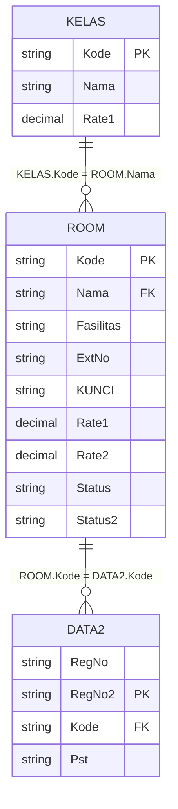
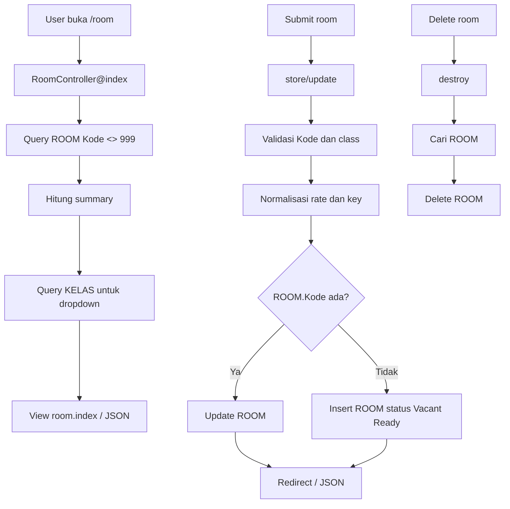

# Room CRUD

Dokumen ini menjelaskan CRUD master room pada route `/room` dan API `/api/v1/room`.

## File Terkait

| Bagian | File |
| --- | --- |
| Controller | `app/Http/Controllers/RoomController.php` |
| View | `resources/views/room/index.blade.php` |
| Route web | `routes/web.php` |
| Route API | `routes/api.php` |

## Fungsi

CRUD ini mengelola master kamar hotel. Data room dipakai oleh check-in, check-out, dashboard, dan night audit.

## Tabel Yang Dipakai

| Tabel | Fungsi | Kolom Utama |
| --- | --- | --- |
| `ROOM` | Master room dan status kamar. | `Kode`, `Nama`, `Fasilitas`, `ExtNo`, `KUNCI`, `Rate1`, `Rate2`, `Rate3`, `Rate4`, `Status`, `Status2`, `Urut` |
| `KELAS` | Master class untuk pilihan class room. | `Kode`, `Nama`, `Rate1` |
| `DATA2` | Data check-in aktif yang memakai room. Tidak diubah oleh CRUD room, tetapi terkait secara operasional. | `Kode`, `RegNo`, `RegNo2`, `Pst` |

## Relasi Tabel

## Endpoint

| Method | Web | API | Fungsi |
| --- | --- | --- | --- |
| GET | `/room` | `/api/v1/room` | List room, summary rate, dan pilihan class. |
| POST | `/room` | `/api/v1/room` | Simpan room baru atau update jika `Kode` sudah ada. |
| POST | `/room/{kode}/update` | PUT/PATCH `/api/v1/room/{kode}` | Update room berdasarkan `Kode`. |
| GET | `/room/{kode}/delete` | DELETE `/api/v1/room/{kode}` | Hapus room berdasarkan `Kode`. |

## Cara Kerja

### List

1. Ambil `ROOM` dengan filter `ROOM.Kode <> '999'`.
2. Hitung summary total room, average `Rate1`, dan average `Rate2`.
3. Ambil list `KELAS` untuk dropdown class.
4. Tampilkan pagination 10 row.

### Create / Store

1. Normalisasi `Kode` dan class code (`Nama`) menjadi uppercase.
2. Validasi `Kode` dan class wajib diisi.
3. Rate dinormalisasi dari input angka/rupiah.
4. Jika `Rate2` kosong, isi sama dengan `Rate1`.
5. Jika `KUNCI` kosong, pakai `Kode` room.
6. Jika room sudah ada, update row.
7. Jika belum ada, insert row baru dengan status default:
   - `Status = 'Vacant Ready'`
   - `MEETING = 0`
   - `VILA = 'N'`
   - `STATUS2 = null`

### Update

1. Cari room berdasarkan `ROOM.Kode`.
2. Jika tidak ditemukan, return error 404.
3. Update class, fasilitas, ext, key, rate, urut, dan username.

### Delete

1. Cari room berdasarkan `ROOM.Kode`.
2. Jika tidak ditemukan, return error 404.
3. Delete row dari `ROOM`.

Catatan: controller saat ini tidak mengecek active check-in `DATA2` sebelum delete room.

## Diagram Alur Kerja

