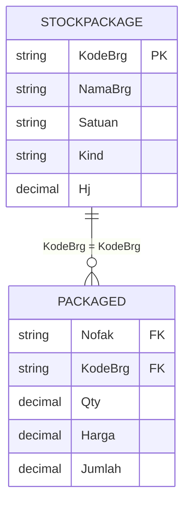
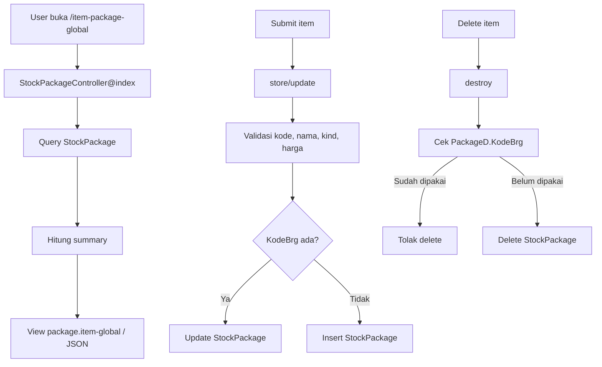

# Stock Package CRUD

Dokumen ini menjelaskan CRUD item package global pada route `/item-package-global` dan API `/api/v1/item-package-global`.

## File Terkait

| Bagian | File |
| --- | --- |
| Controller | `app/Http/Controllers/StockPackageController.php` |
| View | `resources/views/package/item-global.blade.php` |
| Route web | `routes/web.php` |
| Route API | `routes/api.php` |

## Fungsi

CRUD ini mengelola master item yang bisa dimasukkan ke package transaksi. Item dibagi minimal menjadi kategori `ROOM` dan `RESTAURANT`.

## Tabel Yang Dipakai

| Tabel | Fungsi | Kolom Utama |
| --- | --- | --- |
| `StockPackage` | Master item package. | `KodeBrg`, `NamaBrg`, `Satuan`, `Kind`, `Hj`, `Hb`, `Hpr`, `Stock`, `UserName`, `Tgl` |
| `PackageD` | Detail package transaksi. Dipakai untuk mencegah delete item yang sudah digunakan. | `Nofak`, `KodeBrg`, `Qty`, `Harga`, `Jumlah` |

## Relasi Tabel

## Endpoint

| Method | Web | API | Fungsi |
| --- | --- | --- | --- |
| GET | `/item-package-global` | `/api/v1/item-package-global` | List item package dan summary. |
| POST | `/item-package-global` | `/api/v1/item-package-global` | Simpan item baru atau update jika `KodeBrg` sudah ada. |
| POST | `/item-package-global/{kode}/update` | PUT/PATCH `/api/v1/item-package-global/{kode}` | Update item berdasarkan `KodeBrg`. |
| GET | `/item-package-global/{kode}/delete` | DELETE `/api/v1/item-package-global/{kode}` | Delete item jika belum dipakai package detail. |

## Cara Kerja

### List

1. Ambil seluruh item dari `StockPackage`.
2. Urutkan berdasarkan `KodeBrg`.
3. Hitung summary:
   - total item
   - jumlah item `ROOM`
   - jumlah item `RESTAURANT`
   - rata-rata harga jual `Hj`
4. Tampilkan pagination 10 row.

### Create / Store

1. Normalisasi `KodeBrg`, `NamaBrg`, `Satuan`, dan `Kind` menjadi uppercase.
2. Harga jual `Hj` dinormalisasi dari input uang.
3. Validasi:
   - `KodeBrg` wajib
   - `NamaBrg` wajib
   - `Hj > 0`
   - `Kind` hanya boleh `ROOM` atau `RESTAURANT`
4. Jika item sudah ada, update row.
5. Jika belum ada, insert row baru dengan nilai stock/cost default 0.

### Update

1. Cari item berdasarkan `KodeBrg`.
2. Jika tidak ditemukan, return error 404.
3. Update nama, satuan, kind, harga jual, username, dan tanggal.

### Delete

1. Cari item berdasarkan `KodeBrg`.
2. Cek apakah `PackageD.KodeBrg` sudah menggunakan item.
3. Jika sudah digunakan, delete ditolak.
4. Jika belum digunakan, delete dari `StockPackage`.

## Diagram Alur Kerja

